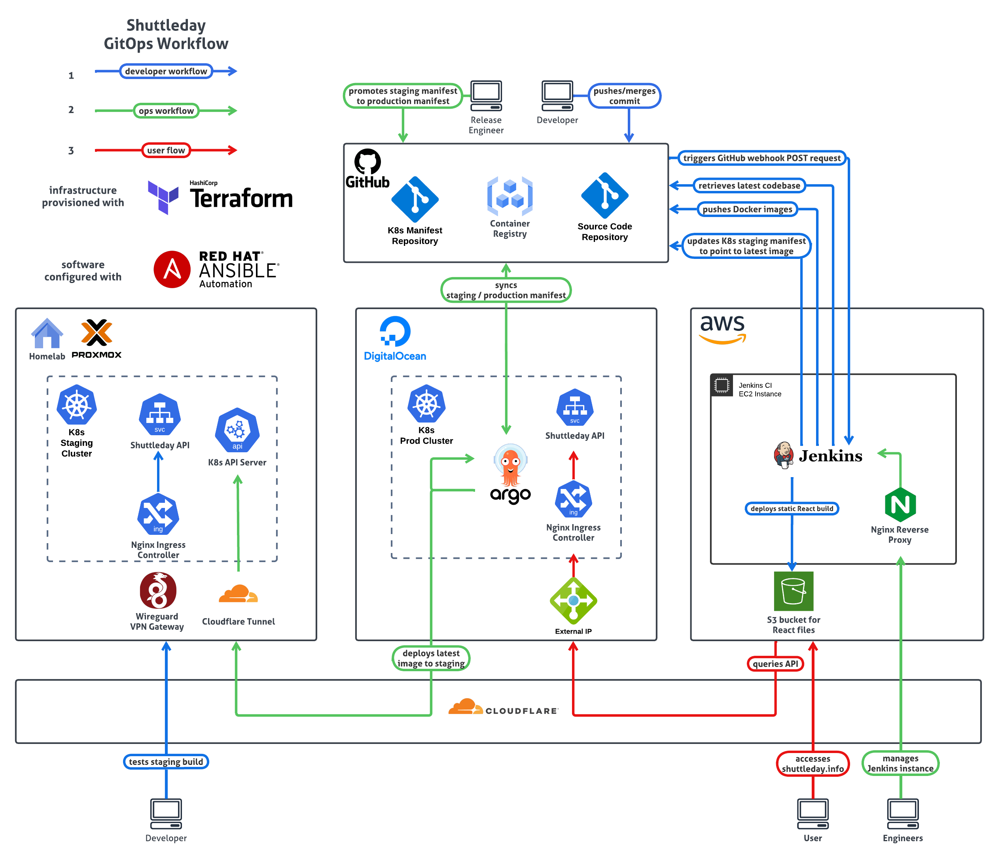

## shuttleday.info

  

  

  

 

  
Table of Contents

  <ol>
    <li>
      <a href="#about">About</a>
      <ol>
        <li><a href="#background">Background</a></li>
        <li><a href="#tech-stack">Tech Stack</a></li>
        <li><a href="#features">Features</a></li>
      </ol>
    </li>
    <li><a href="#read-more">Read More</a>
    <ol>
        <li><a href="./docs/BACKEND_DEV.md">Backend README</a></li>
        <li><a href="./docs/FRONTEND_DEV.md">Frontend README</a></li>
        <li><a href="./docs/DEPLOYMENT.md">Deployment README</a></li>
    </ol>
    </li>
  </ol>

[aws]: https://img.shields.io/badge/Amazon_AWS-FF9900?style=for-the-badge&logo=amazonaws&logoColor=white
[red-hat]: https://img.shields.io/badge/Red%20Hat-EE0000?style=for-the-badge&logo=redhat&logoColor=white
[terraform]: https://img.shields.io/badge/Terraform-7B42BC?style=for-the-badge&logo=terraform&logoColor=white
[ansible]: https://img.shields.io/badge/Ansible-000000?style=for-the-badge&logo=ansible&logoColor=white
[nginx]: https://img.shields.io/badge/Nginx-009639?style=for-the-badge&logo=nginx&logoColor=white
[cloudflare]: https://img.shields.io/badge/Cloudflare-F38020?style=for-the-badge&logo=Cloudflare&logoColor=white
[jenkins]: https://img.shields.io/badge/Jenkins-D24939?style=for-the-badge&logo=Jenkins&logoColor=white
[jest]: https://img.shields.io/badge/Jest-C21325?style=for-the-badge&logo=jest&logoColor=white
[docker]: https://img.shields.io/badge/Docker-2CA5E0?style=for-the-badge&logo=docker&logoColor=white
[kubernetes]: https://img.shields.io/badge/kubernetes-326ce5.svg?&style=for-the-badge&logo=kubernetes&logoColor=white
[argocd]: https://img.shields.io/badge/Argo%20CD-1e0b3e?style=for-the-badge&logo=argo&logoColor=#d16044
[mongodb]: https://img.shields.io/badge/MongoDB-4EA94B?style=for-the-badge&logo=mongodb&logoColor=white
[nodejs]: https://img.shields.io/badge/Node.js-339933?style=for-the-badge&logo=nodedotjs&logoColor=white
[typescript]: https://img.shields.io/badge/TypeScript-007ACC?style=for-the-badge&logo=typescript&logoColor=white
[expressjs]: https://img.shields.io/badge/Express.js-000000?style=for-the-badge&logo=express&logoColor=white
[jwt]: https://img.shields.io/badge/JWT-000000?style=for-the-badge&logo=JSON%20web%20tokens&logoColor=white
[react]: https://img.shields.io/badge/React-20232A?style=for-the-badge&logo=react&logoColor=61DAFB
[javascript]: https://img.shields.io/badge/JavaScript-323330?style=for-the-badge&logo=javascript&logoColor=F7DF1E
[webpack]: https://img.shields.io/badge/Webpack-8DD6F9?style=for-the-badge&logo=Webpack&logoColor=white
[material-ui]: https://img.shields.io/badge/Material%20UI-007FFF?style=for-the-badge&logo=mui&logoColor=white

# About

## Background

[Pierre](https://pierreccesario.com) didn't like using a messaging app for organising badminton sessions. Fortunately he and [Jonathan](https://tjonathan.com) are developers.

## Tech Stack

| Infrastructure                   | Continuous Integration | Container Orchestration | Backend                          | Frontend                        |
| -------------------------------- | ---------------------- | ----------------------- | -------------------------------- | ------------------------------- |
| ![][aws]   ![][red-hat]       | ![][jenkins]           | ![][kubernetes]         | ![][mongodb]                     | ![][react]   ![][javascript] |
| ![][terraform]   ![][ansible] | ![][jest]              | ![][argocd]             | ![][nodejs]   ![][typescript] | ![][webpack]                    |
| ![][nginx]                       | ![][docker]            |                         | ![][expressjs]   ![][jwt]     | ![][material-ui]                |
| ![][cloudflare]                  |                        |                         |                                  |                                 |

## System Architecture

## Features

- GitOps workflow
- Kubernetes HA Deployment
- Passwordless Authentication
- Badminton Session Creation and Participation
- Payment Receipt Upload and Retrieval
- Admin Tooling

# Read More

[BACKEND_DEV.md](./docs/BACKEND_DEV.md)

[FRONTEND_DEV.md](./docs/FRONTEND_DEV.md)

[DEPLOYMENT.md](./docs/DEPLOYMENT.md)
