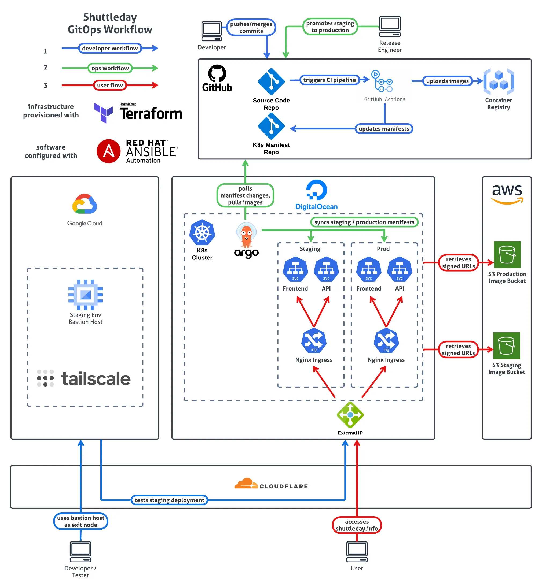

# Deployment

**UNDER CONSTRUCTION**

This document is dedicated to the design and how to set up Shuttleday's entire **infrastructure**, **CI/CD pipeline** and **deployment strategies**.

It aims to replicate the current setup as closely as possible. Regardless, where possible, cloud-provider and software agnostic instructions will be provided.

# System Design

This is a diagram of the infrastructure and software used to host and deploy the Shuttleday project:



## Datacenters

You'll notice the following 5 datacenters:

| Datacenter          | Description                                                                 |
| ------------------- | --------------------------------------------------------------------------- |
| Digital Ocean       | Hosts Kubernetes Prod Cluster (DOKS)                                        |
| Amazon Web Services | Hosts S3 bucket for static website files <br> and a Jenkins CI EC2 instance |
| Homelab             | Hosts Kubernetes Staging Cluster running on a Proxmox server                |
| GitHub              | Origin Git repository and container registry                                |
| Cloudflare          | CDN and DNS for all requests to internal services                           |

## Software

As seen from the System Architecture, you will need to have at least a basic understanding of the following tooling:

### Terraform

Terraform is an Infrastructure-as-Code tool. It works by interacting with the APIs of the datacenters to automatically provision the resources you need via HashiCorp Configuration Language (HCL)

Here we'll use it to provision the virtual machines, S3 buckets and K8s clusters needed to host the Shuttleday project.
It will interact with the Homelab, Digital Ocean and AWS datacenters.

### Ansible

Ansible is a Configuration-as-Code tool. It works via SSH to each individual VM you wish to configure. Hence, it is also agentless, unlike its alternatives.

Once all infrastructure has been provisioned, Ansible will be used to configure the software required to run on them – essentially a bootstrapping process.

### Docker

Docker is a containerisation platform.

This is what we'll use to package the Shuttleday API as well as the MongoDB database.

### Kubernetes

Kubernetes is an open-source container orchestration system for automating software deployment, scaling, and management.

Here, we'll use it to deploy the Shuttleday API containers across the Staging Cluster (Homelab) and Production Cluster (DOKS)

### Jenkins

Jenkins is an open source Continuous Integration tool.

It's what we'll use to perform all our unit tests and Docker image builds.

### ArgoCD

ArgoCD is a Continuous Deployment tool that runs natively in Kubernetes. It continuously polls the Git repository for any changes in the declarative K8s yaml manifests and ensures the current state of the cluster is always synced to the desired state.

Since the development workflow of Shuttleday is of the GitOps model, ArgoCD is a good fit for this project and is what will be used for the CD part of CI/CD.

1. Provision AWS and Cloudflare resources using [terraform-infra](https://github.com/PScoriae/terraform-infra)'s `.tf` files.
2. Configure AWS EC2 servers using [ansible-ec2](https://github.com/PScoriae/ansible-ec2)'s Playbooks.
3. Modify `ansible/inventory`'s target web server to the IP address of your own web server.
4. Setup a GitHub Webhook on your forked repository to point to your Jenkins instance.
5. Add a new Jenkins Pipeline job and point it to your forked repo with the following enabled:
   - Do not allow concurrent builds
   - GITScm polling
   - Pipeline Script from SCM
   - Repository URL should be whatever your forked repository's URL is
   - Branches to build: `*/main`
   - Additional Behaviours:
     - Polling ignores commits in certain paths: `README.md` in **Excluded regions**

If all was configured well, a new Docker Compose build should automatically be deployed from your CICD build server to your Web server after each push or merge to the `main` branch.

## Local Deployment

This section details how to locally deploy the Docker Compose on your own dev machine.

1. Run the build command to compile the source code, as detailed in the [Building](#building) section.
2. Run the following command in the root directory of this project:
   ```bash
   docker compose -f docker-compose.local.yml up -d --build
   ```
   What this command does is instruct `docker compose` to use the `docker-compose.local.yml` file and simultaneously build the shuttleday backend before composing and starting the MongoDB container, shuttleday backend and shuttleday web app itself.
